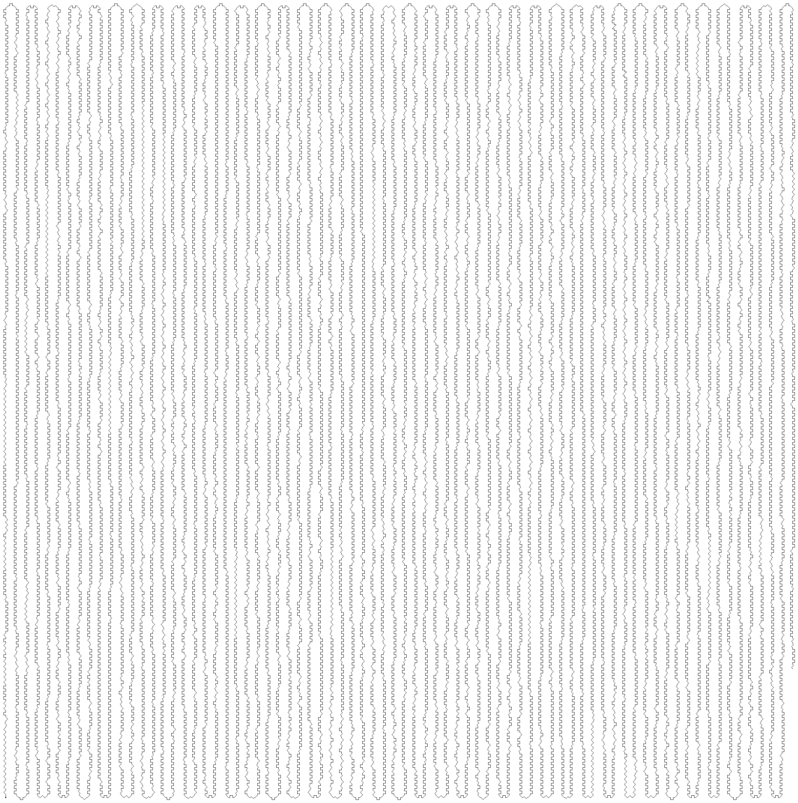
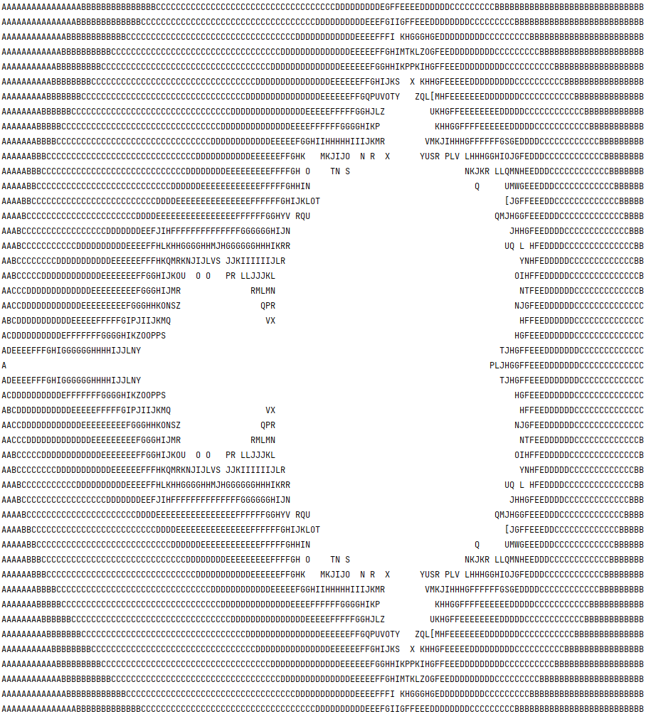

# CurvaLang Generator

A desktop application for generating CurvaLang programs.

Of course, CurvaLang programs can be created in many ways including the manual one, but with a generator, it's much easier.

## CurvaLang Programs

In CurvaLang, a program is a curve, hence the name. Here are some examples:

### Hello world

The following program prints "Hello World!":

### Mandelbrot set

Another program we have visualizes the Mandelbrot set:

And here is what it prints:

## How to use the generator

Run it via `./gradlew run` (Linux/Mac) or `.\gradlew.bat run` (Windows). JDK 17 is needed.

In the opened app, specify a text of a BrainFuck program and the path of the desired curve.

The format of the path is a list of '<direction_char><integer>' elements joined to a string with `-` as separators. `<direction_char>` can be `L` or `R` for turns on the path, but the first direction char must be `N`, `W`, `S`, or `E` for the side of the world for the initial direction of the curve. The integer means the length of the curve in the desired direction. So the `N20-R3-L33` path means that the curve starts from going North (up) 20 units of distance, then it rotates right (R) and goes 3 more units, and so on (let's skip the last element here that should now be obvious).

The path can be also empty. This will make the resulting curve vertical, but will allow to visualize loops (by activating a dedicated checkbox).

Press the button and get the image with the curve. The image will be shown in the UI and also be saved in the `./lastGenerated.png` file.

The resulting images can be used with the interpreter.
